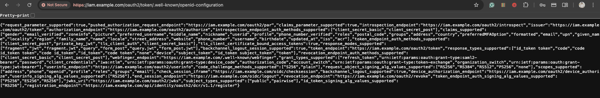
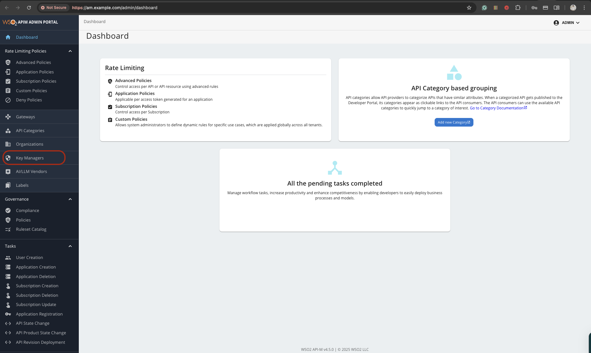
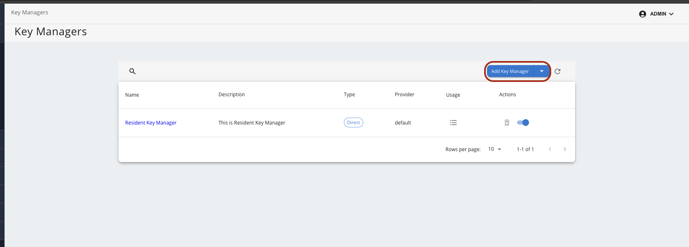
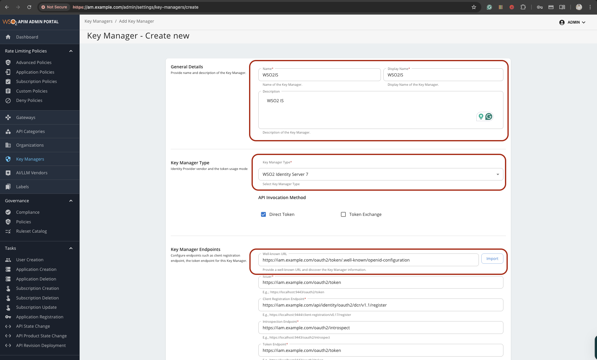
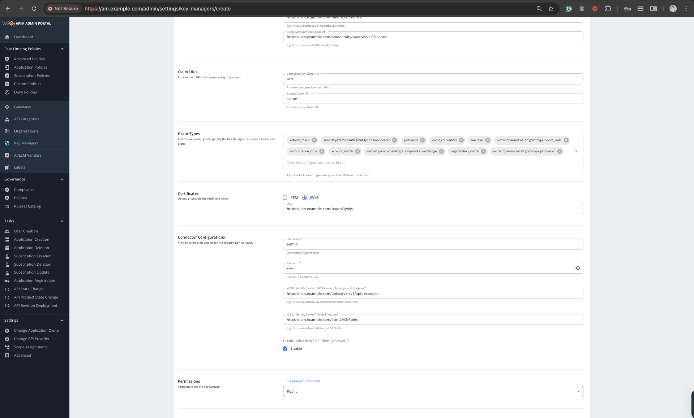
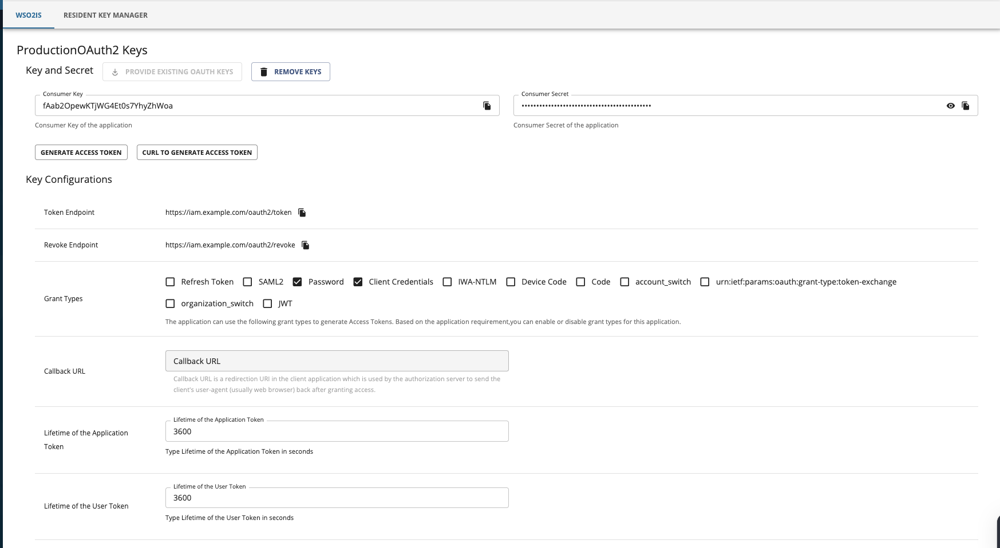
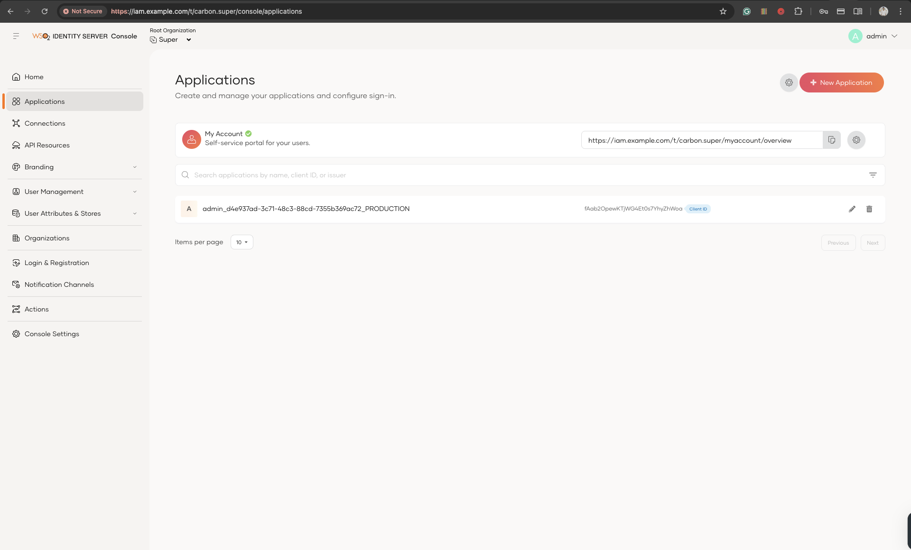
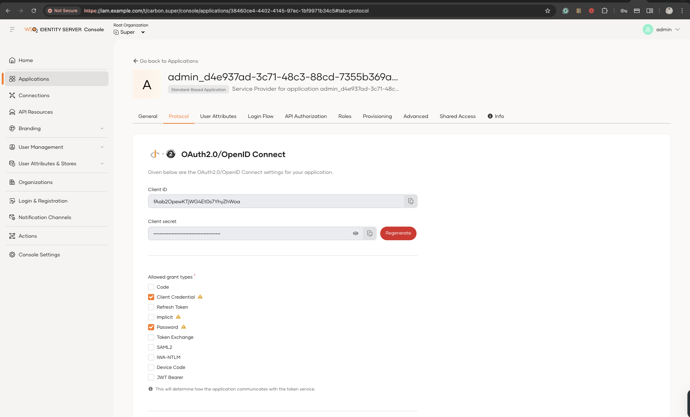

# WSO2 APIM + IS + Traefik stack

Production-ready docker-compose setup that runs WSO2 API Manager (APIM) and WSO2 Identity Server (IS) behind a Traefik v3 reverse proxy with a repo-managed self-signed certificate and a shared MySQL 8.0 backend. The layout borrows the hardened configurations from the upstream [`docker-apim`](https://github.com/wso2/docker-apim) and [`docker-is`](https://github.com/wso2/docker-is) repositories, but keeps everything self-contained inside this folder.

## Components

- **Traefik** – terminates TLS with a multi-SAN self-signed certificate generated by `install.sh`, and exposes the APIM and IS endpoints via SNI routing.
- **MySQL 8.0** – single instance that hosts the APIM (`WSO2AM_DB`, `WSO2AM_SHARED_DB`) and IS (`WSO2IS_IDENTITY_DB`, `WSO2IS_SHARED_DB`) schemas created via the bundled SQL scripts copied from the official WSO2 repos.
- **WSO2 API Manager** – defaults to `wso2/wso2am:4.5.0`, configured to sit behind Traefik and rely on MySQL. A slim Dockerfile wraps the upstream image to bake in the requested MySQL Connector/J driver at build time.
- **WSO2 Identity Server** – defaults to `wso2/wso2is:7.1.0`, also configured for MySQL and exposed through Traefik. The companion Dockerfile follows the same pattern for the connector jar.

## Prerequisites

- Docker Engine 24+ and Docker Compose plugin 2.20+.
- Hostname resolution for the domains you plan to use (`am.example.com`, `api.example.com`, etc.). Because this stack now ships with a self-signed certificate, you can either publish DNS records or add entries to `/etc/hosts` during development.
- Optional but recommended: a valid WSO2 subscription if you need the latest patched images from the private registry.

## Directory layout

```
WSO2_APIM_IS_Traefik/
├── config/
│   ├── traefik/            # Static + dynamic Traefik config (TLS, serversTransport)
│   │   └── certs/          # Generated self-signed cert/key pair
│   └── mysql/scripts/      # MySQL schema bootstrap SQL files from upstream repos
├── conf/                   # Generated WSO2 config (created by install.sh)
├── templates/              # deployment.toml templates with placeholder tokens
├── docker-compose.yml      # Combined Traefik + MySQL + APIM + IS stack
├── .env.example            # Sample values for manual editing
└── install.sh              # Interactive helper that prepares .env, configs, and TLS material
```

## Quick start

1. **Clone and inspect**

	```bash
	cd WSO2_APIM_IS_Traefik
	ls
	```

2. **Run the installer** to capture your domains, image tags, and passwords. It writes `.env`, renders the APIM/IS `deployment.toml` files, and (if OpenSSL is present) generates a SAN-enabled self-signed certificate under `config/traefik/certs/`.

	```bash
	./install.sh
	```

	Edit `.env` or any generated config under `conf/` if you need to fine-tune values (e.g., switch to images hosted in `docker.wso2.com`).

3. **Build + start the stack** (Compose will build the custom APIM/IS images automatically)

	```bash
	docker compose up -d --build
	```

	The first boot takes a few minutes while MySQL initializes the schemas and WSO2 services perform their setup runs.

3.1 Add /etc/hosts

	Add the following mapping to your `/etc/hosts` file (use `127.0.0.1` if running locally, or your server's IP):

	```
	127.0.0.1 api.example.com am.example.com iam.example.com traefik.example.com
	```

4. **Access the portals** (replace the hostnames with whatever you configured):

	- `https://am.example.com/publisher`, `https://am.example.com/devportal`, `https://am.example.com/admin`, `https://am.example.com/carbon`
	- `https://api.example.com` for the gateway endpoints (8243/8280 routed through Traefik).
	- `https://iam.example.com/console` and `https://iam.example.com/myaccount` for the Identity Server apps.
	- `https://traefik.example.com` for the Traefik dashboard (no auth by default—restrict at the DNS/firewall level or add basic auth labels if needed).

## Configuration flow

| Item | How it is set |
| ---- | ------------- |
| `.env` | Generated by `install.sh` (or copy from `.env.example`).
| `conf/apim/.../deployment.toml` | Rendered from `templates/apim/...` using the answers you provide to the installer.
| `conf/is/.../deployment.toml` | Rendered from `templates/is/...` with the same helper.
| `config/mysql/scripts/*.sql` | Direct copies from the upstream repos to guarantee schema compatibility.
| `config/traefik/*.yml` | Static files checked into this repo; edit if you need extra routers or middlewares.

## Operational tips

- **Re-running install.sh**: If you run `./install.sh` again, it may regenerate the self-signed certificate. If the certificate changes, you **must** rebuild the Docker images (`docker compose up -d --build`) so the new certificate is imported into the WSO2 truststores.
- **TLS trust**: import the generated certificate from `config/traefik/certs/selfsigned.crt` into your OS/browser trust store or use tooling such as `mkcert`/`trust` to avoid warnings.
- **Schema upgrades**: when you bump APIM/IS versions, re-apply the latest SQL scripts from the official repos to keep in sync, and re-run `install.sh` if the templates changed.
- **Apple Silicon / ARM64**: the WSO2 base images are amd64-only, so the compose file pins those services to `linux/amd64`. Docker Desktop/OrbStack will take care of QEMU emulation; expect the first build to take slightly longer.
- **External key manager**: this compose keeps APIM's built-in key manager. If you need APIM to delegate key management to the standalone IS instance, follow the WSO2 "APIM with IS as KM" guide and extend the supplied templates accordingly.
- **Backups**: persist `/var/lib/mysql` (handled via the `mysql-data` volume) and keep copies of `.env`, `conf/`, and `config/traefik/certs/` for disaster recovery.

## Cleanup

```
docker compose down --volumes
rm -f .env conf/apim/repository/conf/deployment.toml conf/is/repository/conf/deployment.toml config/traefik/certs/selfsigned.{crt,key}
```

> ⚠️ The cleanup command removes databases and configuration; run it only if you intend to reset the environment.


---
Add WSO2 IS to WSO2 APIM. 

first search for wellknown. 

```
https://iam.<domain>/oauth2/token/.well-known/openid-configuration


https://iam.example.com/oauth2/token/.well-known/openid-configuration
```



Go to APIM admin portal `https://am.example.com/admin` and go to `key manager`



In keymanger -> add new key manager


Add wellknown and click import. all of the necessary config will import



You will left with `Scope Management Endpoint`

```
https://iam.example.com/api/identity/oauth2/v1.0/scopes
```

Add connector Connector Configurations and others
```
username - admin
password - admin
wso2 identity server 7 api management endpoint - https://iam.example.com/api/server/v1/api-resources

wso2 identity server 7 role endpoint - https://iam.example.com/scim2/v2/Roles
```


Click `Add` button. 

---
## Test the setup. 

Go to the wso2 APIM, Devportal -> Application


Click any Application (`Default Application`). You can see `WSO2IS` as new key manager


After generate Key. You can see the client ID and Client Secret




That Id and key is the Same in WSo2 IS -> Application. 






Users in Identity server can now call the APIs with that client ID and Client secret